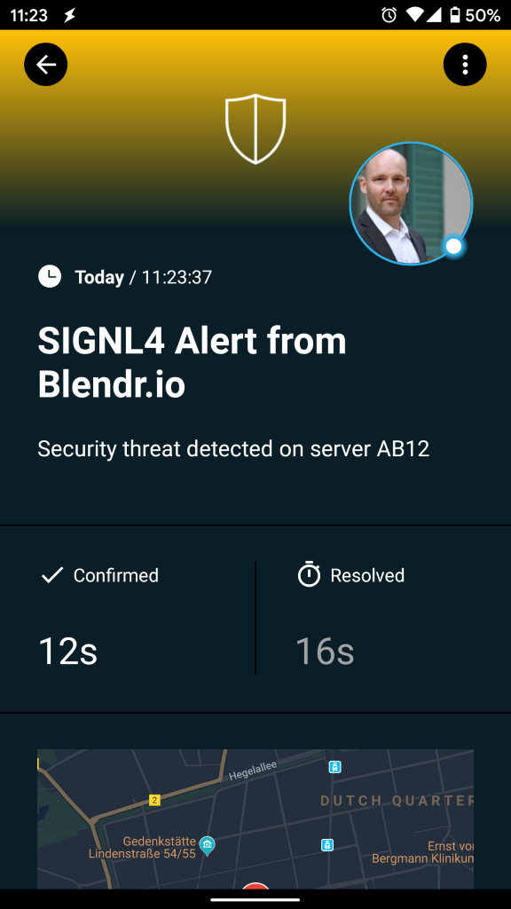
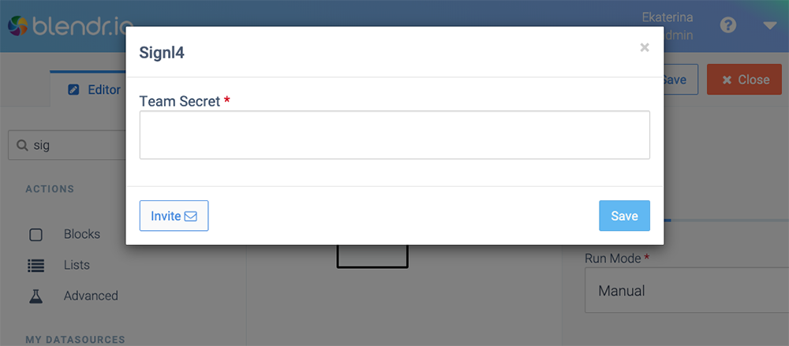

# Mobile Alarmierung per App, SMS und Anruf für Blendr.io

Mobile Alarmierung mit Tracking, Bereitschafts-Planung und Eskalation für Blendr.io.

## Warum SIGNL4

Blendr.io ist eine Integrations-Plattform, die ein komplettes Toolkit für SaaS-basierte Integrationen bietet, um Ihre Kunden, Ihr Erfolgs-Management-Team und Ihre Entwickler zu unterstützen. Mit schnellen und sicheren nativen Integrationen unterstützt Blendr.io Entwickler bei zeitaufwändigen Integrations- und Wartungsaufgaben. Die Integration dieser leistungsstarken Plattform mit SIGNL4 kann Ihren täglichen Betrieb durch die zuverlässige Alarmierung mobiler Teams verbessern, egal wo sich diese befinden.

## So funktioniert es

SIGNL4 ist als native Integration in Blendr.io verfügbar. Alles, was für die Verknüpfung von Blendr.io mit SIGNL4 nötig ist der die SIGNL4 Integration, die Sie in Ihrem Blend einfügen können, um Ihr Team zu alarmieren.

## Integration

- Alarmierung von Wartungsteams in SIGNL4 per mobilem Push, Text und Sprache
- Anbindung an SIGNL4 per Email (SMTP API)
- Transparente Quittierung in der mobilen App
- Eskalation von Alarmen wenn eine bestimmte Zeit verstrichen ist
- Team-Kommunikation innerhalb von Alarmen
- Nachvollziehbarkeit der Störungs-Behebung
- Integrierte Bereitschafts-Planung, um die richtigen Personen zur richtigen Zeit zu alarmieren
- Alarmierung über kritische IoT-Status
- Mögliche Zwei-Wege-Integration zur Interaktion mit Geräten

## Szenarien

- Workflow-Automatisierung
- DevOps
- IT-Betriebsabläufe
- Service-Management
- IoT
- Produktion und Fertigung, Versorgungs-Sektor, Öl und Gas, Landwirtschaft, etc.

## Und so funktioniert es

### Integration von SIGNL4 mit Blendr.io

SIGNL4 ist eine mobile App mit der Teams schneller und effektiver auf kritische Alarme, technische Störungen und dringende Service-Aufträge reagieren können. Holen Sie sich die App unter https://www.signl4.com.

Im folgenden Blend senden wir Ticket-Informationen von Zendesk an SIGNL4.

### Voraussetzungen

Ein SIGNL4-Konto (https://www.signl4.com)

Ein Blendr.io Konto (https://www.blendr.io)

#### Integrations-Schritte

1. SIGNL4 Integration  

In Ihrem Blend können Sie einfach die native SIGNL4-Integration einfügen, wann immer Sie Benachrichtigungen an Ihr SIGNL4-Team senden möchten. Sie müssen lediglich Ihr SIGNL4-Team-Geheimnis konfigurieren.

2. Testen Sie es  

Starten Sie den Blend und wenn die SIGNL4-Integration ausgeführt wird, wird ein Alarm an Ihr SIGNL4-Team gesendet.

Ein Beispiel finden Sie auf in GitHub:
https://github.com/signl4/signl4-integration-blendr-io
