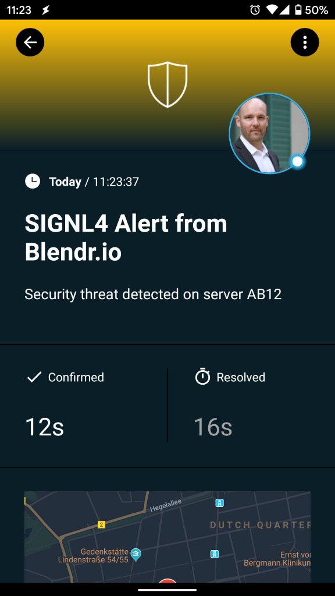
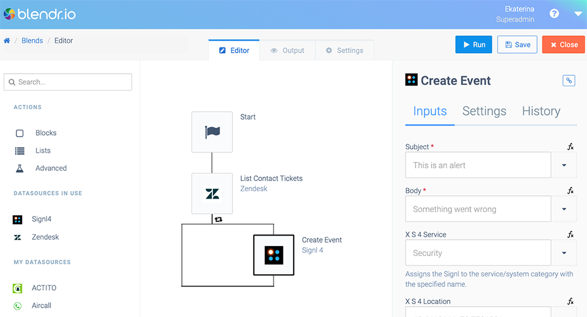
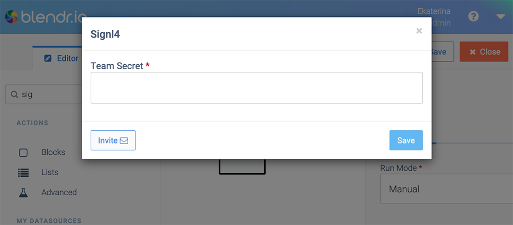

# Mobile alerting with tracking & escalation for Blendr.io

Mobile alerting with tracking, duty planning and escalation for Blendr.io.

## Why SIGNL4

Blendr.io is an SaaS integration platform that offers a complete integration toolkit to empower your customers, success management team and developers. With rapid and secure native integrations Blendr.io helps developers with time-consuming integration and maintenance tasks. Pairing this powerful platform with SIGNL4 can enhance your daily operations with an extension to your team wherever it is.

## How it Works

SIGNL4 is available as a native Integration in Blendr.io. All you need to link Blendr.io to SIGNL4 is the SIGNL4 Integration that you can easily insert into your Blend whenever you need yo alert your team.

## Integration Capabilities

- Service engineers alerted via mobile push, text and voice
- Integration with SIGNL4 via webhook or email (SMTP)
- Staff can acknowledge and take ownership for critical events that occur
- Alerts are escalated in case of no response
- Communicate within an alert to address a particular problem
- Tracking and visibility of problem solutions
- Integrated on-call duty planning
- Alert on critical IoT device states
- Two-way integration to interact or set the device state

## Scenarios

- Workflow automation
- DevOps
- IT operations
- Service Management
- IoT
- IT, Manufacturing, Utility, Oil and Gas, Agriculture, etc.

## How To Integrate

### Integrating SIGNL4 with Blendr.io

SIGNL4 is a mobile alert notification app for powerful alerting, alert management and mobile assignment of work items. Get the app at https://www.signl4.com.

In the Blend below we send ticket information from Zendesk to SIGNL4.

### Prerequisites

A SIGNL4 (https://www.signl4.com) account

A Blendr.io (https://www.blendr.io) account

#### Integration Steps

1. SIGNL4 Integration  

In your Blend you can just insert the native SIGNL4 Integration whenever you wish to send notifications to your SIGNL4 team. You just need to configure your SIGNL4 team-secret.

2. Test It  

Start the Blend and when the SIGNL4 integration is executed, an alarm will be sent to your SIGNL4 team.

You can find a sample in GitHub:
https://github.com/signl4/signl4-integration-blendr-io
